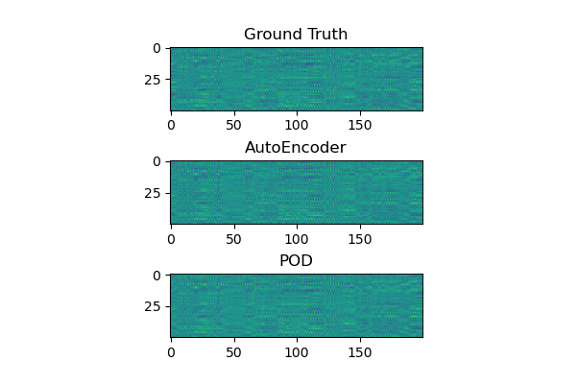
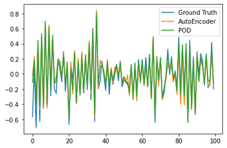
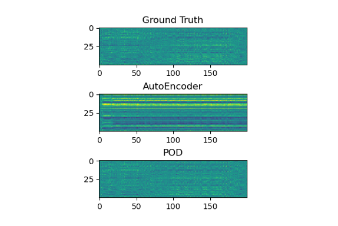
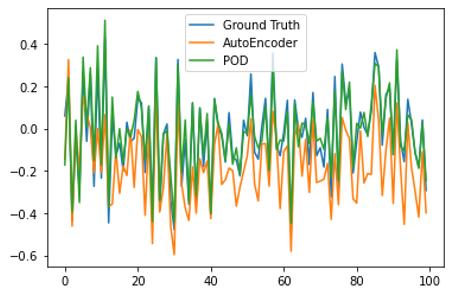
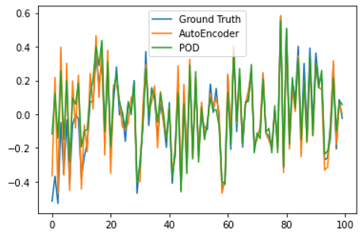
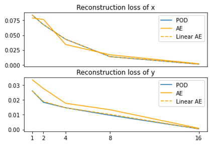
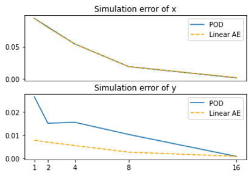
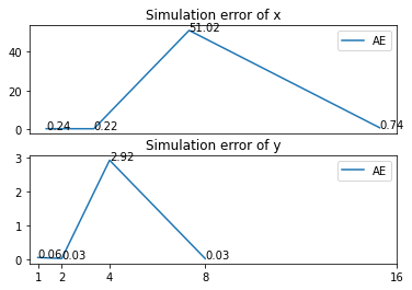

# Model Order Reduction (MOR) in Control System
Author: Pengcen Jiang, Yi Gu, Shibo Hao
Course: DSC 210: Linear Algebra/Data Science, FA22@UCSD
Instructor: Dr. Tsui-wei Weng

### Instructions
- Ensure that the following libraries are installed in python 3 environment:
    - numpy
    - torch
    - matplotlib
    - scipy
- Open `MOR_in_control_system.ipynb` and run all the cells of the notebook.

### Repository Structure
- `DynamicSystem.py`: Contains the basic classes of a dynamic system, and a linear dynamic system.
- `models.py`: Contains classes of neural network models.
- `MOR.py`: The implementation of two MOR methods. They are encapsulated as subclass of a dynamic system.
- `util.py`: Helper functions.
- `MOR_in_control_system.ipynb`: A notebook for conducting experiment and presenting the results.

### Primary Results 

Here we show all the numeric and figurative results. Please refer to our report for the detailed settings of the experiment and  the analysis of the results.

#### Fitting
| Metric   | POD    | AE     |
| -------- | ------ | ------ |
| MSE of X | 0.0077 | 0.0076 |
| MSE of Y | 0.0028 | 0.0038 |

#### Generalization

| Metric   | POD    | AE     |
| -------- | ------ | ------ |
| MSE of X | 0.0121 | 1.9652 |
| MSE of Y | 0.0034 | 0.0549 |

#### Replacing AE with Linear AE

#### Reduction Dimension

