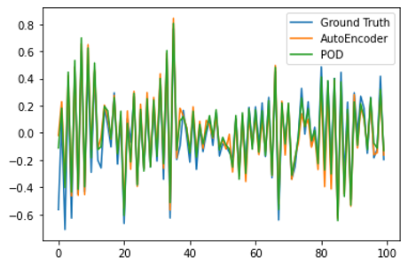
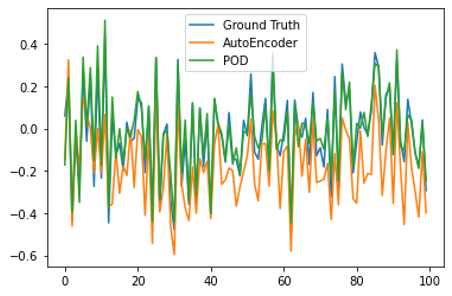

# Model Order Reduction on Control Systems

### Supervisor:

Dr. Tsui-Wei Weng

### Posted:

Dec 6, 2022

### Course:

DSC 210 FA’22 Numerical Linear Algebra

---

### Team:

- Pengcen Jiang
PID: A59020457
HDSI

- Yi Gu
PID: A59019647
HDSI

- Shibo Hao
PID: A59017927
HDSI

---

---

## 1. Introduction

A **Control System** is an interactive dynamical system that can be controlled by external inputs. Denoted the state variable of the system as a vector $\mathbf{x}$, then its change over time, or the derivative over time, is considered as a function of the state variable and the external input $\mathbf{u}$, written as $\dot{\mathbf{x}}=f(\mathbf{x},\mathbf{u})$. It is called a control system because we can control the state variables by changing $\mathbf{u}$. One may not get the state variable directly, and this generate an observation (for examples, via some sensors attached to the system) of the system $\mathbf{y}=h(\mathbf{x})$. 

Usually, we look at the fixed points of the system, where the state variable would not change without an external input, which gives out $f(\mathbf{x^*})=0$. Then, the system dynamics around the fixed point can be linearized by Taylor expansion: $f(\mathbf{x^*}+\Delta\mathbf{x})=f(\mathbf{x^*})+f'(\mathbf{x^*})\Delta\mathbf{x}+\mathbf{o}(\Delta\mathbf{x}^2)\approx f'(\mathbf{x^*})\Delta\mathbf{x}$. To simplify, we only consider the situation around a fixed point, and we also consider a linear influence of the external input and a linear readout. Then, a linear control system can be described by the equations below: 

$$
\dot{\mathbf{x}}=\mathbf{A}\mathbf{x}+\mathbf{B}\mathbf{u}\\ \mathbf{y}=\mathbf{C}\mathbf{x}
$$

Or in discrete-time form, 

$$
\mathbf{x_t}=\mathbf{A}\mathbf{x_{t-1}}+\mathbf{B}\mathbf{u_t}\\ \mathbf{y_t}=\mathbf{C}\mathbf{x_t}
$$


---

### 1.1 History/Background:

Real-world mathematical models are high-dimensional and complex, making numerical simulation challenging. **Model Order Reduction (MOR)** is applied to reduce the degree of freedom of the state space to lower computational complexity, while making the approximate error small and preserving the properties of the original system (such as stability and passivity). 

One can do MOR by projecting the state space $\mathbf{x}$ into a low-dimensional subspace, written as $\hat{\mathbf{x}}$. In the meantime, the reduced order model (ROM) should give out approximately the same output $\hat{\mathbf{y}}$ as the original system if a deterministic input $\mathbf{u}$ is given.

There are several methods to do MOR. Methods based on linear algebra, such as Proper Orthogonal Decomposition (POD), often reduce the dimension by keeping only the dominant modes in the original model. POD is first proposed by Sirovich in 1987 [9]. It has been widely applied to numerical fields, such as in solving partial differential equations (PDEs) since being proposed [10]. Many other MOR methods have been proposed by POD, such as PODROEFD [11]. 

The rise of deep learning brings Autoencoder, a method based on neural network. It’s hard to tell when autoencoder, or the term ”Autoencoder” appears, its application dates back to 1980s. It is widely used for dimensionality reduction, image processing, anomaly detection and so on [12]. The encoding (compression) and decoding process in Autoencoder can be considered as order reduction and data restoration in our problem setting. As a neural network, it can also deal with non-linear problems. 

---

### 1.2 Applications:

Control system is widely used in engineering design and mathematical modeling of any system that can be described by ordinary differential equations, such as

- Stock market modeling
- Neuroscience modeling
- Climate prediction
- Electrical circuit modeling
- Fluid mechanics modeling
- Epidemic modeling
- Cruise control for automobiles
- Temperature control in industrial furnace

By numerical modeling and simulation one can foresee how the desired system would respond to a given input, and accordingly decide how to take actions to generate a desired output. MOR is very helpful in the modeling of these problems. With MOR, one can lower the computation cost while generate satisfactory result. 

---

### 1.3 State-of-the-art:

In this report, we study two approaches for MOR: 

- Proper Orthogonal Decomposition (POD)
- Autoencoder (AE)

Both are data-driven methods. **Proper Orthogonal Decomposition (POD)** is the linear algebra method we select to conduct MOR. POD would be suitable for linear systems, but there are also non-linear control systems. **Autoencoder (AE)**, as a deep neural network method, can handle non-linear problem by adding nonlinearity to its layers. In this report, we will compare the performance of POD, linear AE and non-linear AE on a linear system we generated in section [3. Experiments](https://www.notion.so/Model-Order-Reduction-on-Control-Systems-869031a7ff1d4901a6732b2fd84f1097).

---

---

## 2. Problem Formulation

### 2.1 Relation to numerical linear algebra:

The idea lay behind MOR is dimensionality reduction. Principal component analysis (PCA) and singular value decomposition (SVD) are two popular projection methods in linear algebra to reduce dimension. The problem converts into finding the proper projection directions for data and the system parameter matrices. We’ll solve it by considering a coordinate transition first. 

### Model Coordinate Transition

If we do a coordinate transition on the model, i. e. we suppose $\mathbf{x}$ is rotated from a vector $\mathbf{z}$ with an orthogonal matrix $\mathbf{T}$, $\mathbf{x}=\mathbf{Tz}$, that gives out: 

$$
\mathbf{T}\dot{\mathbf{z}}=\mathbf{A}(\mathbf T\mathbf{z})+\mathbf{B}\mathbf{u}\\ \mathbf{y}=\mathbf{C}(\mathbf{T}\mathbf z)
$$

Pre multiply the first formula by $\mathbf T^{-1}$,  the set of new dynamics coefficient matrices with regard to a new state variable $\mathbf{z}$ after coordinate transition is:             

$$
\hat{\mathbf{A}}=\mathbf{T}^{-1}\mathbf{AT}\\ \hat{\mathbf{B}}=\mathbf{T}^{-1}\mathbf{B}\\ \hat{\mathbf{C}}=\mathbf{CT}
$$

One can find a proper orthogonal matrix $\mathbf{T}$, and reduce the model dimension by only preserving the dominant eigenvectors in $\mathbf{T}$ (get $\widetilde{\mathbf{T}}$), and also retrieve the state $\mathbf{x}$ via $\mathbf{x}\approx\widetilde{\mathbf{T}}\widetilde{\mathbf{x}}$. Here $\widetilde{\mathbf{x}}$ is variable obtained from MOR. 

To get a ROM via find a $\mathbf{T}$, the general idea is to find the dominant mode in the dynamics of the system, which would take use of principal component analysis (PCA) and singular value decomposition (SVD). 

Our question would be to reduce the dimension of the system properly, and then evaluate the performance of obtained ROM by looking at its reconstructing and simulation performance on both the innate state and the observation. 

---

### 2.2 Approach description:

### Proper orthogonal decomposition

Proper orthogonal decomposition (POD) is a data-driven method. POD takes snapshots of the model’s innate state at different time steps, and embeds the high dimensional dynamic into a lower dimensional space by using a proper basis $\{\mathbf u_i\}_{i=1}^r$.

We take snapshots at $t$ different time steps to form a matrix $\mathbf X_{n \times t}$, where each column of $\mathbf X$ represents the state variable $\mathbf x_i$ in the $i$-th snapshot.

We can perform SVD on $\mathbf X = \mathbf U \mathbf \Sigma \mathbf V^\mathsf T, \mathbf U = \mathbb R^{n \times n}, \mathbf V = \mathbb R^{t \times t}$. The columns $(\mathbf u_1, \dots, \mathbf u_n)$ of matrix $\mathbf U$ is the POD basis of $\mathbb R^n$. We can perform a truncation of $\mathbf U$ to its first $r$ columns (denoted by $\mathbf U_r$) based on the ordered singular values $\sigma_1 > \sigma_2 > \dots > \sigma_n$.

Then the reduced order model is obtained by projecting the state $\mathbf x$ onto $\mathbf U_r$, the first $r$ basis vector in the POD basis $\mathbf U$. The projection can be performed by $\tilde {\mathbf x} = \mathbf U_r^\mathsf T \mathbf x$, or recovered by $\mathbf x \approx \mathbf U_r \tilde {\mathbf x}$. The reduced model is given by

$$
\dot{\tilde{\mathbf{x}}}=(\mathbf U_r^\mathsf T \mathbf A \mathbf U_r)\tilde{\mathbf{x}}+(\mathbf U_r^\mathsf T \mathbf B)\mathbf{u}\\ \tilde{\mathbf{y}}=(\mathbf C \mathbf U_r)\tilde{\mathbf{x}}
$$

where the new coefficients are

$$
\hat{\mathbf A} = \mathbf U_r^\mathsf T \mathbf A \mathbf U_r \\ \hat{\mathbf B} = \mathbf U_r^\mathsf T \mathbf B \\ \hat{\mathbf C} = \mathbf C \mathbf U.
$$

---

### 2.3 SOTA Approach description:

### Autoencoder

As POD introduce a linear projection to reduce model order, we turn MOR into a learning problem and learn an optimal projection with neural network. The capability of neural network to represent non-linear projection can further improve the efficiency of MOR.

Since the projection is non-linear, we can no longer use a matrix to represent it. Instead, we represent the projection as $\varrho$ and the inverse projection as $\varrho^{\dagger}$.

A classic neural architecture for dimension reduction is autoencoder (AE). AE takes into the original input $x$ and compress it into a lower-dimension vector $z$, and reconstruct $\tilde{x}$ from it. Here the encoder and decoder correspond to $\varrho$ and $\varrho^{\dagger}$, respectively. An example is shown in the figure below:


The objective function can be written as

$$
\tilde x = \varrho^\dagger(x) \\ \hat x = \varrho(\tilde x) \\ \min_{\varrho^\dagger, \varrho} \sum_{x \in \mathcal X} \Vert x - \hat x \Vert^2
$$

Then, the encoder and decoder will be jointly trained to minimize the objective function with gradient-based methods.

After the autoencoder is trained, we can write the dynamic system in the lower-dimensional space of $\tilde{x}$. By applying chain rule and plugging in the differential equation of the original dynamic system, we can get the differential equation of $\tilde{x}$.

$$
\dot{\tilde{x}}(t) =\frac{\partial \varrho}{\partial x} \cdot \frac{d x}{d t}
$$

Plugging in the differential equation of the original system, we can get the reduced system.

### Comparison with POD

We can regard autoencoder as a nonlinear extension of POD. With the strong capability of neural networks to fit any functions, we expect autoencoder to more efficiently compress the state space in nonlinear dynamic systems.

The cost of more expressiveness may be the complexity of this method. Learning a neural network means there will be more computational cost, more efforts on hyperparameter tunning. Besides, we also need more training data to reduce the chance of overfitting.

---

### 2.4 Evaluation:

We want to compare two things: 

- After MOR, how close is the observation $\hat{\mathbf{y}}$ predicted by the reduced order model and the observation $\mathbf{y}$ of the original system.
- Given a reduced order system and its low-dimensional dynamics $\hat{\mathbf{x}}$, how well can we restore the dynamics $\mathbf{x}$ of the original system.

The comparison is made by calculating the mean square error (MSE):  

$$
\mathrm{MSE}(\mathbf{X}_1, \mathbf{X}_2)=\frac{1}{\#\mathbf{X}_1}\sum_{j=1}^{\#\mathbf{X}_1}\Vert\mathbf{X}_{1j}- \mathbf{X}_{2j}\Vert^2_2
$$

Here $\mathbf{X}_1$ and $\mathbf{X}_2$ are two sets of trajectory data, and the time steps of each trajectory should be equal (noted as $\#\mathbf{X}_1=\#\mathbf{X}_2$). Also, the dimension of each time step should be equal (noted as $\mathrm{dim}\mathbf{X}_{1j}=\mathrm{dim}\mathbf{X}_{2j}, \ \forall j$. Here $\mathbf{X}_{ij}, i=1,2$ means the state value at $j$th time step. 

The comparison is made on both the training set and testing set.

---

---

## 3. Experiments

### 3.1 Setup and logistics:

Here are the tools we use: 

Programming language: 

- Python

Libraries:

- Numpy: used for data generalization and matrix manipulation
- Scipy: used to assist data generalization
- Pytorch: model the autoencoder
- matplotlib: visualization

Software tools:

- VS Code: provide python and Jupyter notebook enviroment
- Notion: write report
- GitHub: saving code and version control

---

### 3.2 Dataset and preprocessing:

We’re not using a data set but generating a toy linear system and get the data by simulation with the toy system. Here are the settings of generation:

- We choose the dimension of innate state $\mathbf{x}$ to be 50, the dimension of observation $\mathbf{y}$ to be 1, and the dimension of input $\mathbf{u}$ to be 5.
- Then, the matrix $\mathbf{A}$ is a $50\times50$ matrix, $\mathbf{B}$ is a $50\times5$ matrix, $\mathbf{C}$ is a $1\times50$ matrix.
- Each entry of $\mathbf{B}$ and $\mathbf{C}$ is generated from Gaussian distribution with $0$ mean, standard deviation is $0.1$. $\mathbf{A}$ obeys Wishart distribution (so that $\mathbf{x}$ would obey Gaussian distribution), but we substituted the eigenvalues of $\mathbf{A}$ with random values uniformly distributed in $[-1,1]$, so that the system would not explode (that is, the values of $\mathbf{x}$ and $\mathbf{y}$ would not approach infinity within limited time steps.
- Each entry of the initial state $\mathbf{x}_0$ and input $\mathbf{u}$ is generated with Gaussian distribution, $0$ mean and standard deviation $1$.
- Then, $\mathbf{x}_t$ and $\mathbf{y}_t$ can be generated iteratively. We generated 5000 times steps.

We generated two sets of data, one is used to train the POD method and AE, another is used as testing set. 

We defined a class for a linear system

```python
# define the linear system
import torch
import time

import numpy as np
import numpy.random as nrd
import numpy.linalg as nla
import matplotlib.pyplot as plt
from scipy.stats import wishart
from copy import deepcopy

class Dynamic_System:
    def __init__(self, dim_x, dim_u, dim_y):
        self.dim_x = dim_x
        self.dim_u = dim_u
        self.dim_y = dim_y

    def init_coef(self):
        pass

    def step(self, x, u):
        pass
    
    def gen(self, x0, u, length):
        pass

    def get_y(self, x):
        pass
    
    
class Linear_Dynamic_System(Dynamic_System):
    '''
    dim_x: int, dimension of inate state of the system
    dim_u: int, dimension of input
    dim_y: int, dimension of observation (output)
    sys_param: dict, parameters of the dynamic matrices and noises' variance
      x_t = Ax_{t-1} + Bu_t
      y_t = Cx_t
      sys_param['A'] - matrix on x_{t-1}
      sys_param['B'] - matrix on u_t
      sys_param['C'] - matrix on x_t
    '''
    def __init__(self, dim_x, dim_u, dim_y, sys_param={}):
        super().__init__(dim_x, dim_u, dim_y)
        # self.dim_x = dim_x
        # self.dim_u = dim_u
        # self.dim_y = dim_y
        self.sys = self.init_coef(sys_param)
    
    def init_coef(self, sys):
        if not ('A' in sys):
            A0 = wishart.rvs(200, 2 * np.eye(self.dim_x, dtype='float32'))
            [_, eig_vec] = nla.eig(A0)
            eig_val = (np.diag(nrd.random(self.dim_x) - 0.5) ) * 2
            # set abs eigenvalues no larger than 1 so that it would not blow up
            eig_val = eig_val.astype(np.float32)
            sys['A'] = eig_vec @ eig_val @ np.transpose(eig_vec)
        if not ('B' in sys): 
            sys['B'] = nrd.randn(self.dim_x, self.dim_u) * 0.1
        if not ('C' in sys):
            sys['C'] = nrd.randn(self.dim_y, self.dim_x) * 0.1
            sys['C'] = sys['C'].astype(np.float32)

        for k, v in sys.items():
            sys[k] = np.array(v, dtype='float32')
        return sys
    
    def step(self, x, u):
        # print()
        x = self.sys['A'] @ x + self.sys['B'] @ u #  + epsilon
        y = self.sys['C'] @ x
        return x, y
    
    def gen(self, x0, u, length):
        '''
        Input: 
          x0 - initial state of the system, shape (dim_x, 1)
          u - stimulus of the system, shape (dim_u, length)
          length - time steps to simulate
        Output:
          x - inate state, shape (dim_x, length)
          y - observation of the system, shape (dim_y, length) 
        '''
        xt = x0
        for i in range(length):
            ut = u[:, i].reshape(self.dim_u, -1)
            xt, yt = self.step(xt, ut)
            if i == 0:
                x = xt
                y = yt
            else: 
                x = np.concatenate([x, xt], axis=1)
                y = np.concatenate([y, yt], axis=1)
        return x, y

    def get_y(self, x):
        # print(self.sys['C'].shape, x.shape)
        return self.sys['C'] @ x
```

Then, data is generated with code:

```python
# define the dimension of the system
dim_x = 50 # dimension of inate state
dim_y = 1 # dimension of output
dim_u = 5 # dimention of input
time_steps = 5000 # time steps to be generated
dim_x_reduct = 10 # dimension after MOR

original_sys = Linear_Dynamic_System(dim_x, dim_u, dim_y) # define a system

# randomly generate the input u and x0
u = np.random.randn(dim_u, time_steps)
x0 = np.random.randn(dim_x, 1)

# generate data
x, y = original_sys.gen(x0, u, time_steps)
print("the shape of x: ", x.shape)
print("the shape of y: ", y.shape)
```

---

### 3.3 Implementation:

- We want to explore two questions:
    - (Fitting) Given a known trajectory from a linear dynamic system, how well do the MOR methods reconstruct the states and observations?
    - (Generalization) Given an initial state and a sequence of inputs, how well do the MOR method predict the upcoming states and observations?
- Formally:
    - The models are trained on a known trajectory, given the states $\mathbf{X}_{train} \in \mathbb{R}^{T\cdot D}$.
    - The models compress  $\mathbf{X}_{train}$ to $\widetilde{\mathbf{X}}_{train} \in \mathbb{R}^{T\cdot D’}$
    - (Fitting) Reconstruct $\hat{\mathbf{X}}_{train}$ with $\widetilde{\mathbf{X}}_{train}$, and predict $\hat{\mathbf{Y}}_{train}$  and compare it with $\mathbf{X}_{train}$, $\mathbf{Y}_{train}$
    - (Generalization) Given an initial state  $\mathbf{x}_{test}^{(0)} \in \mathbb{R}^{D}$, and a sequence of input $\mathbf{u} \in R^{T\cdot D_{\mathbf{u}}}$ , the models first compress $\mathbf{x}_{test}^{(0)}$ to a lower dimensional space and simulate the system in the compressed space, resulting in $\widetilde{\mathbf{X}}_{test}$ . The recovered $\hat {\mathbf{X}}_{test}$ and $\hat{\mathbf{Y}}_{test}$ are compared to $\mathbf{X}_{test}$  and $\mathbf{Y}_{test}$ generated with the ground truth dynamic system.

Now, we need to implement POD and AE. 

We implement POD as the following class: 

```python
class POD_Reduced_System(Linear_Dynamic_System):
    def __init__(self, original_sys, dim_x_reduct):
        super().__init__(dim_x_reduct, original_sys.dim_u, original_sys.dim_y)
        self.original = original_sys
    def fit(self, x):
        U, _, _ = np.linalg.svd(x)
        self.Ur = Ur = U[..., :self.dim_x]
        self.sys = self.init_coef({'A': Ur.T @ self.original.sys['A'] @ Ur,
                                   'B': Ur.T @ self.original.sys['B'],
                                   'C': self.original.sys['C'] @ Ur})
        rec_x = Ur @ Ur.T @ x
        rec_y = self.original.sys['C'] @ rec_x
        return rec_x, rec_y
    def step(self, x, u):
        return super().step(x, u)
    def compress(self, x):
        return self.Ur.T @ x
    def decompress(self, x):
        return self.Ur @ x
```

To implement AE for MOR, we first need to implement autoencoders. We implement linear autoencoder and nonlinear autoencoder. 

```python
class AE_linear(torch.nn.Module):
    
    def __init__(self, input_dim, output_dim):
        super().__init__()
         
        self.encoder = torch.nn.Linear(input_dim, output_dim)
         
        # Building an linear decoder with Linear
        # layer followed by Relu activation function
        # The Sigmoid activation function
        # outputs the value between 0 and 1
        # 9 ==> 784
        self.decoder = torch.nn.Linear(output_dim, input_dim)

    def forward(self, x):
        encoded = self.encoder(x)
        decoded = self.decoder(encoded)
        return decoded

class AE_nonlinear(torch.nn.Module):

    def __init__(self, input_dim, output_dim):
        super().__init__()
         
        self.encoder = torch.nn.Sequential(
            torch.nn.Linear(input_dim, 128),
            torch.nn.ReLU(),
            torch.nn.Linear(128, output_dim),
            torch.nn.ReLU()
        )
         
        self.decoder = torch.nn.Sequential(
            torch.nn.Linear(output_dim, 128),
            torch.nn.ReLU(),
            torch.nn.Linear(128, input_dim)
        )

    def forward(self, x):
        encoded = self.encoder(x)
        decoded = self.decoder(encoded)
        return decoded
```

Then, AE model for MOR can be implemented as:

```python
class AE_Reduced_System(Dynamic_System):
    
    def __init__(self, original_sys, dim_x_reduct, nonlinear=True):
        super().__init__(original_sys.dim_x, original_sys.dim_u, original_sys.dim_y)
        self.original_sys = original_sys
        self.dim_x_reduct = dim_x_reduct
        self.nonlinear = nonlinear

    def fit(self, x):
        tensor_x = torch.from_numpy(x.T).float()

        if self.nonlinear:
            model = AE_nonlinear(tensor_x.shape[1], self.dim_x_reduct)
        else:
            model = AE_linear(tensor_x.shape[1], self.dim_x_reduct)
        
        criterion = torch.nn.MSELoss()
        optimizer = torch.optim.Adam(model.parameters(), lr=1e-2, weight_decay=0)
        scheduler = torch.optim.lr_scheduler.StepLR(optimizer, step_size=200, gamma=0.5)
        
        for epoch in range(2000):
            optimizer.zero_grad()
            outputs = model(tensor_x)
            loss = criterion(outputs, tensor_x)
            loss.backward()
            optimizer.step()
            scheduler.step()
            if epoch % 100 == 0:
                pass
                # print('epoch [{}/{}], loss:{:.4f}'.format(epoch, 1000, loss.item()))

        self.model = model
        reconst_x = self.model(tensor_x).detach().numpy().T  # dim_x * n
        reconst_y = self.original_sys.get_y(reconst_x) # dim_y * n
        return reconst_x, reconst_y
```

---

### 3.4 Results and compare:

- (Fitting) We first do evaluation on the training data. For each timestamp, we reduce the dimension of $\mathbf x_t$ to $\tilde {\mathbf x_t}$ and recover it to $\hat{\mathbf x_t}$, we also use  $\tilde {\mathbf x_t}$ to predict $\hat{\mathbf y_t}$. We calculate the MSE on both $\mathbf X$ and $\mathbf{Y}$ over the whole training data. We also plot $\hat{\mathbf X}$ (the heat map on the left) and $\hat{\mathbf Y}$ (the line chart on the right), compared to $\mathbf X$ and $\mathbf Y$ below.
    - We do experiments with reduced dimension being $10$.
    - We can see that both methods are good at fitting the training data.
    - The code is attached below.

| Metric | POD | AE |
| --- | --- | --- |
| MSE of X | 0.0077 | 0.0076 |
| MSE of Y | 0.0028 | 0.0038 |




```python
ae_sys = AE_Reduced_System(original_sys, dim_x_reduct, nonlinear=True)
reconst_x_AE, reconst_y_AE = ae_sys.fit(x)

pod_sys = MOR.POD_Reduced_System(original_sys, dim_x_reduct)
reconst_x_POD, reconst_y_POD = pod_sys.fit(x)

print(mse(reconst_x_POD, x), mse(reconst_x_AE, x))
plt.figure(figsize=(100, 100), dpi=100)
f, (ax1, ax2, ax3) = plt.subplots(3, 1)
ax1.imshow(x[:, :200], vmin=-2, vmax=2)
ax1.set_title("Ground Truth")
ax2.imshow(reconst_x_AE[:, :200], vmin=-2, vmax=2)
ax2.set_title("AutoEncoder")
ax3.imshow(reconst_x_POD[:, :200], vmin=-2, vmax=2)
ax3.set_title("POD")
plt.subplots_adjust(hspace=0.8)
plt.savefig("rec_x.png", dpi=100)

print(mse(reconst_y_POD, y), mse(reconst_y_AE, y))
plt.plot(y.reshape(-1)[:100], label="Ground Truth")
plt.plot(reconst_y_AE.reshape(-1)[:100], label="AutoEncoder")
plt.plot(reconst_y_POD.reshape(-1)[:100], label='POD')
plt.legend()
```

- (Generalization) We then do evaluation on another set of data, consisting only of the initial state $\mathbf x_0$, and input in all timestamps $\{\mathbf u_t\}_{t=1}^T$. Note that the gound-truth state of each following step is not available to the models. We use the same metric as fitting, and do similar plotting.
    - We do experiments with reduced dimension being $10$.
    - We can see that the POD-system simulates the original system pretty well.
    - But the AE-system shows an obvious deviation from the gound-truth trajectory.
    - In our experiment, AE-system even sometimes collapse to numeric overflow, especially when the reduced dimension increases, or the training data is insufficient.
    - The code is attached below.

| Metric | POD | AE |
| --- | --- | --- |
| MSE of X | 0.0121 | 1.9652 |
| MSE of Y | 0.0034 | 0.0549 |




```python
def get_test_sets(x0, u_test, original_sys, time_steps): 
    true_xs, true_ys = [], []
    true_x = x0
    for i in range(time_steps):
        true_x, true_y = original_sys.step(true_x, u_test[:, i])
        true_ys.append(true_y[0])
        true_xs.append(true_x)
    true_xs = np.stack(true_xs).T
    true_ys = np.array(true_ys)
    return true_xs, true_ys

def get_test_predict(x0, u_test, reduction_sys, time_steps):
    new_x = reduction_sys.compress(x0)
    pred_xs, pred_ys = [], []
    for i in range(time_steps):
        new_x, new_y = reduction_sys.step(new_x, u_test[:, i])
        # print(true_y.shape, new_y.shape)
        pred_ys.append(new_y[0])
        pred_xs.append(reduction_sys.decompress(new_x))
    pred_xs = np.stack(pred_xs).T
    pred_ys = np.array(pred_ys)
    return pred_xs, pred_ys

true_xs, true_ys = get_test_sets(true_x, u_test, original_sys, time_steps)
ae_xs, ae_ys = get_test_predict(true_x, u_test, ae_sys, time_steps)
pod_xs, pod_ys = get_test_predict(true_x, u_test, pod_sys, time_steps)

print(mse(true_xs, ae_xs), mse(true_xs, pod_xs))
f, (ax1, ax2, ax3) = plt.subplots(3, 1)
ax1.imshow(true_xs[:, :200], vmin=-2, vmax=2)
ax1.set_title("Ground Truth")
ax2.imshow(ae_xs[:, :200], vmin=-2, vmax=2)
ax2.set_title("AutoEncoder")
ax3.imshow(pod_xs[:, :200], vmin=-2, vmax=2)
ax3.set_title('POD')
plt.subplots_adjust(hspace=0.8)
plt.savefig("pre_x.png", dpi=100)

print(mse(true_ys, ae_ys), mse(true_ys, pod_ys))
plt.plot(true_ys[:100], label="Ground Truth")
plt.plot(ae_ys[:100], label="AutoEncoder")
plt.plot(pod_ys[:100], label="POD")
plt.legend()
```

- (AE without non-linearity) Since our simulated system is linear, we hypothesize that AE may overfit the training trajectory due to its strong fitting ability. We validate our hypothesis by using a linear-AE. We remove the non-linearity activation function. Theoretically, the optimal parameter of linear-AE should be the same as POD. In our experiments, linear-AE do show a  behavior similar to POD. The code is the same as above, except that `nonlinear=False`.


- (Reduction dimension) We plot the reconstruction loss (fitting metrics) and simulation error (generalization metrics) to different reduced dimensions below. Missing values indicate NaN caused by numeric overflow.
    - As expected, POD and linear-AE perform better in all metrics when the dimension grows
    - POD and linear-AE is the same as fitting a know trajectory, but a little difference in formulation makes linear-AE better at predicting $\mathbf y$. The details are presented in the appendix.
    - The behavior of AE is unpredictable, probably because the overfit in training process, which we have discussed above.
    - The code is attached below.


```python
u_test = np.random.randn(dim_u, time_steps)
true_x = np.random.randn(dim_x)
true_xs, true_ys = get_test_sets(true_x, u_test, original_sys, time_steps)

from tqdm import tqdm
dim_x_reduct_list = [1, 2, 4, 8, 16]

mse_train_list_x_pod = []
mse_test_list_x_pod = []
mse_train_list_y_pod = []
mse_test_list_y_pod = []

# POD
for dim_reduc in tqdm(dim_x_reduct_list):
    pod_sys = MOR.POD_Reduced_System(original_sys, dim_reduc)
    reconst_x_POD, reconst_y_POD = pod_sys.fit(x)
    mse_train_list_y_pod.append(mse(y, reconst_y_POD))
    mse_train_list_x_pod.append(mse(x, reconst_x_POD))

    pod_xs, pod_ys = get_test_predict(true_x, u_test, pod_sys, time_steps)
    mse_test_list_x_pod.append(mse(true_xs, pod_xs))
    mse_test_list_y_pod.append(mse(true_ys, pod_ys))

mse_train_list_x_ae = []
mse_test_list_x_ae = []
mse_train_list_y_ae = []
mse_test_list_y_ae = []

# with nonlinearity
for dim_reduc in tqdm(dim_x_reduct_list):
    ae_sys = AE_Reduced_System(original_sys, dim_reduc, nonlinear=True)
    reconst_x_AE, reconst_y_AE = ae_sys.fit(x)
    mse_train_list_y_ae.append(mse(y, reconst_y_AE))
    mse_train_list_x_ae.append(mse(x, reconst_x_AE))

    ae_xs, ae_ys = get_test_predict(true_x, u_test, ae_sys, time_steps) 
    mse_test_list_x_ae.append(mse(true_xs, ae_xs))
    mse_test_list_y_ae.append(mse(true_ys, ae_ys))

mse_train_list_y_linear_ae = []
mse_train_list_x_linear_ae = []
mse_test_list_x_linear_ae = []
mse_test_list_y_linear_ae = []

# without nonlinearity
for dim_reduc in tqdm(dim_x_reduct_list):
    
    linear_ae_sys = AE_Reduced_System(original_sys, dim_reduc, nonlinear=False)
    reconst_x_linear_AE, reconst_y_linear_AE = linear_ae_sys.fit(x)
    mse_train_list_y_linear_ae.append(mse(y, reconst_y_linear_AE))
    mse_train_list_x_linear_ae.append(mse(x, reconst_x_linear_AE))

    linear_ae_xs, linear_ae_ys = get_test_predict(true_x, u_test, linear_ae_sys, time_steps) 
    mse_test_list_x_linear_ae.append(mse(true_xs, linear_ae_xs))
    mse_test_list_y_linear_ae.append(mse(true_ys, linear_ae_ys))

# plot the result - x
fig, (ax1, ax2) = plt.subplots(2, 1)

ax1.plot(dim_x_reduct_list, mse_train_list_x_pod, label='POD')
ax1.plot(dim_x_reduct_list, mse_train_list_x_ae, color='orange',label='AE')
ax1.plot(dim_x_reduct_list, mse_train_list_x_linear_ae, '--b', color='orange', label='Linear AE')
ax1.set_title('Reconstruction loss of x')
ax1.legend()
ax1.set_xticks([])

ax2.plot(dim_x_reduct_list, mse_train_list_y_pod, label='POD')
ax2.plot(dim_x_reduct_list, mse_train_list_y_ae, color='orange',label='AE')
ax2.plot(dim_x_reduct_list, mse_train_list_y_linear_ae, '--b', color='orange', label='Linear AE')
ax2.legend()
ax2.set_xticks(dim_x_reduct_list)
ax2.set_title('Reconstruction loss of y')

# plot the result - y
fig, (ax1, ax2) = plt.subplots(2, 1)

ax1.plot(dim_x_reduct_list, mse_test_list_x_pod, label='POD')
ax1.plot(dim_x_reduct_list, mse_test_list_x_linear_ae, '--b', color='orange', label='Linear AE')
ax1.set_title('Simulation error of x')
ax1.legend()
ax1.set_xticks([])

ax2.plot(dim_x_reduct_list, mse_test_list_y_pod, label='POD')
ax2.plot(dim_x_reduct_list, mse_test_list_y_linear_ae, '--b', color='orange', label='Linear AE')
ax2.legend()
ax2.set_xticks(dim_x_reduct_list)
ax2.set_title('Simulation error of y')

# plot the result - simulation AE
fig, (ax1, ax2) = plt.subplots(2, 1)

ax1.plot(dim_x_reduct_list, mse_test_list_x_ae, label='AE')
ax1.set_title('Simulation error of x')
ax1.legend()
ax1.set_xticks([])
for i, j in zip(dim_x_reduct_list, mse_test_list_x_ae):
    ax1.text(i, j, f"{j.round(2)}")

ax2.plot(dim_x_reduct_list, mse_test_list_y_ae, label='AE')
ax2.legend()
ax2.set_xticks(dim_x_reduct_list)
for i, j in zip(dim_x_reduct_list, mse_test_list_y_ae):
    ax2.text(i, j, f"{j.round(2)}")
ax2.set_title('Simulation error of y')
```

---

### 3.5 Comparison:

- POD uses numerical linear algebra to extract principal components for of innate state $\mathbf{x}$. AE is a popular neural network model, and the reduction is by project on a layer with less hidden neurons.
- POD is efficient on reduction of linear systems, and easy to implement.
- AE is more sophisticated and expressive, but it requires more careful training, and sometimes may destroy the stability of the original system. For MOR of linear dynamic system, AE is not a good choice.

---

---

## 4. Conclusion

- This project covered the problem of model order reduction in a linear control system.
- We implemented Proper Orthogonal Decomposition (POD) and Autoencoder (AE) as ways to solve this problem, and compare them in terms of reconstruction and simulation.
- To diagnose the behavior of AE, we remove the non-linear function and make a connection to POD.
- As shown by the experimental results, POD constantly perform better in both experiment settings and different dimensions, and it is more stable than AE.
- When we have a prior knowledge about the dynamic system that it is linear, we should use POD for order reduction.

---

---

## 5. Acknowledgements

We are really grateful to Prof. Tsui-Wei Weng, Halıcıoğlu Data Science Institute, UC San Diego for her continuous support, encouragement, and willingness to help us throughout this project.

---

---

## 6. References

[1] En.wikipedia.org. 2022. *Model order reduction - Wikipedia*. [online] Available at: <[https://en.wikipedia.org/wiki/Model_order_reduction](https://en.wikipedia.org/wiki/Model_order_reduction)>.

[2] En.wikipedia.org. 2022. *Control theory - Wikipedia*. [online] Available at: <[https://en.wikipedia.org/wiki/Control_theory](https://en.wikipedia.org/wiki/Control_theory)>.

[3] Schilders, W. H., Van der Vorst, H. A., & Rommes, J. (2008). *Model order reduction: theory, research aspects and applications* (Vol. 13, p. 13). Berlin: springer.

[4] Baur, U., Benner, P., & Feng, L. (2014). Model order reduction for linear and nonlinear systems: a system-theoretic perspective. *Archives of Computational Methods in Engineering*, *21*(4), 331-358.

[5] P. Astrid, S. Weiland, K. Willcox and T. Backx (2008). Missing Point Estimation in Models Described by Proper Orthogonal Decomposition*.* *IEEE Transactions on Automatic Control*, vol. 53, no. 10, pp. 2237-2251, Nov. 2008, doi: 10.1109/TAC.2008.2006102.

[6] Youtube.com. 2022. *Data-Driven Control with Machine Learning. - Steve Brunton* [online] Available at: <[https://www.youtube.com/playlist?list=PLMrJAkhIeNNQkv98vuPjO2X2qJO_UPeWR](https://www.youtube.com/playlist?list=PLMrJAkhIeNNQkv98vuPjO2X2qJO_UPeWR)>

[7] Youtube.com. 2022. *Control Bootcamp. - Steve Brunton* [online] Available at: <[https://www.youtube.com/playlist?list=PLMrJAkhIeNNQkv98vuPjO2X2qJO_UPeWR](https://www.youtube.com/playlist?list=PLMrJAkhIeNNR20Mz-VpzgfQs5zrYi085m)>

[8] Kashima, K. (2016, December). Nonlinear model reduction by deep autoencoder of noise response data. In *2016 IEEE 55th conference on decision and control (CDC)* (pp. 5750-5755). IEEE.

[9] Sirovich, L. (1987). Turbulence and the dynamics of coherent structures, Parts I, II and III. *Quart. Appl. Math.*, 561-590.

[10] Luo, Z., & Chen, G. (2018). *Proper orthogonal decomposition methods for partial differential equations*. Academic Press.

[11] An, J., Luo, Z., Li, H., & Sun, P. (2015). Reduced-order extrapolation spectral-finite difference scheme based on POD method and error estimation for three-dimensional parabolic equation. *Frontiers of Mathematics in China*, *10*(5), 1025-1040.

[12] En.wikipedia.org. 2022. *Autoencoder* *- Wikipedia*. [online] Available at: <[https://en.wikipedia.org/wiki/Autoencoder](https://en.wikipedia.org/wiki/Autoencoder)>.

---

---

## 7. Appendix

### 7.1 Difference between POD and Linear AE

Assuming the compressing projection is $U$, and decompressing projectino is $V$. In the implementation of linear autoencoder, we have

$$
\begin{align}\hat y_t &= C\hat x_t\\&=C(\hat x_{t-1} + d\hat x_{t-1}) \\&=C(A\hat x_{t-1}+Bu_{t-1})\\&=C((A+I)V\tilde x_{t-1}+Bu_{t-1})\end{align}
$$

 Recall the formulation of POD, we define the new dynamic as:

$$
\dot{\tilde{\mathbf{x}}}=(\mathbf U_r^\mathsf T \mathbf A \mathbf U_r)\tilde{\mathbf{x}}+(\mathbf U_r^\mathsf T \mathbf B)\mathbf{u}\\ \tilde{\mathbf{y}}=(\mathbf C \mathbf U_r)\tilde{\mathbf{x}}
$$

Here $V=U_r, U=U_r^T$, and we have

$$
\begin{align}\hat y_t &= C\hat x_t\\&=C(V\tilde x_{t})\\&=C(V(\tilde x_{t-1}+d \tilde x_{t-1}))\\&=C(V(\tilde x_{t-1}+U(A(V\tilde x_{t-1})+Bu_{t-1})))\\&=C((VUA + I)V\tilde x_{t-1} + Bu_{t-1})\end{align}
$$

Compared with Linear Autoencoder, it contains an additional $VU$ term, which should be a truncated identity matrix, creating a deadweight loss of information. However, since this term comes from $d\tilde x_{t-1}$, which only matters in discrete time sequence. We expect the two implementation to be the same in real world. The derivation above only accounts for the difference we observe in our experiment.